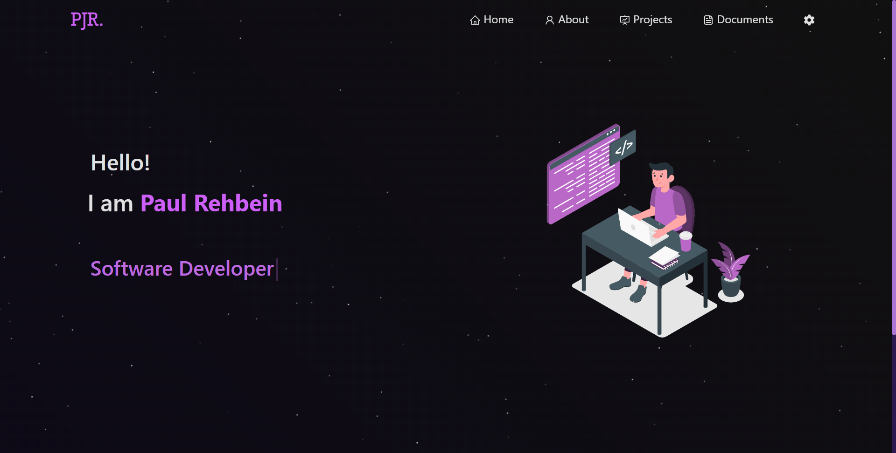

<h2 align="center">
  My personal portfolio<br/>
  <a href="https://paulrehbein.com" target="_blank">paulrehbein.com</a>
</h2>
<div align="center">
  
</div>

<br/>


## Built With

This project was built using the following technologies:

- React.js
- Node.js
- CSS3
- Visual Studio Code
- Vercel

## Features

- **Multi-Page Layout:** Comprehensive layout with various sections to highlight different aspects of my work.
- **Styled with React-Bootstrap and Custom CSS:** Modern and customizable design to reflect my personal brand.
- **Fully Responsive:** Designed to work seamlessly across all device sizes.


### Installation and Setup Instructions

1. **Clone the repository:**

    ```bash
    git clone https://github.com/PJR23/portfolio.git
    ```

2. **Navigate to the project directory:**

    ```bash
    cd portfolio
    ```

3. **Install the dependencies:**

    ```bash
    npm install
    ```

4. **Start the development server:**

    ```bash
    npm start
    ```

5. **View the Portfolio:**

    - Open [http://localhost:3000](http://localhost:3000) in your web browser to see the portfolio in action.
    - The page will automatically reload if you make changes to the source files.
